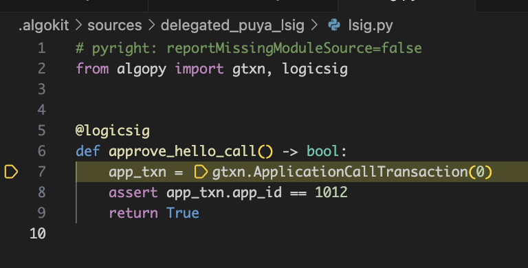
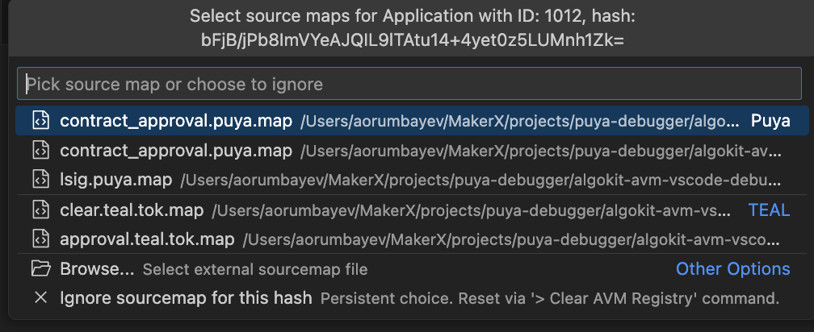

<div align="center">
  <a href="https://github.com/algorandfoundation/algokit-avm-vscode-debugger"></a>
</div>

<p align="center">
  <a target="_blank" href="https://github.com/algorandfoundation/algokit-avm-vscode-debugger/blob/main/README.md"></a>
  <a target="_blank" href="https://developer.algorand.org/algokit/"></a>
  <a target="_blank" href="https://marketplace.visualstudio.com/items?itemName=algorandfoundation.algokit-avm-vscode-debugger"></a>
  <br />
  <a target="_blank" href="https://github.com/algorandfoundation/algokit-avm-vscode-debugger"></a>
  <a target="_blank" href="https://developer.algorand.org/algokit/"></a>
</p>

---

The AlgoKit AVM VS Code Debugger extension enables line-by-line debugging of Algorand smart contracts on the AVM, whether written in TEAL directly or compiled from [Puya](https://github.com/algorandfoundation/puya). It leverages AVM simulate traces and source maps to provide a seamless debugging experience. For detailed setup instructions, see the [Detailed Usage](#detailed-usage) section.

---

<div align="center">
  <a href="https://github.com/algorandfoundation/algokit-avm-vscode-debugger"></a>
</div>

---

The core functionality is built on top of the [AlgoKit AVM Debug Adapter](https://github.com/algorandfoundation/algokit-avm-debugger). Additionally, a set of companion utilities are provided in the [TypeScript](https://github.com/algorandfoundation/algokit-utils-ts/blob/main/docs/capabilities/debugging.md) and [Python](https://github.com/algorandfoundation/algokit-utils-py/blob/main/docs/source/capabilities/debugging.md) versions of `algokit-utils`, making it easier for developers to set up the required prerequisites and run the debugger.

> To skip straight to the list of features, go to [Features](#features).

## Contents

- [Prerequisites](#prerequisites)
- [Installation](#installation)
  - [Via VS Code Marketplace](#via-vs-code-marketplace)
  - [For Development](#for-development)
- [Usage](#usage)
  - [AlgoKit based project (recommended)](#a-algokit-based-project-recommended)
  - [Custom Project](#b-custom-project)
- [Features](#features)
- [Contact](#contact)

## Prerequisites

Before you can use the AVM Debugger extension, you need to ensure that you have the following installed:

- [Visual Studio Code](https://code.visualstudio.com/download): Version 1.80.0 or higher. You can check your version by going to `Help > About` in VS Code.
- [Node.js](https://nodejs.org/en/download/): Version 18.x or higher. The extension is built with Node.js. Check your Node.js version by running `node -v` in your terminal/command prompt.

### Quick Start

Below is a bare-bones example of how to get started with the AVM Debugger extension in an AlgoKit based project relying on `algokit-utils`.

1. **Enable debugging in algokit-utils**:

   ```typescript
   // In your main file (TypeScript)
   import * as algokit from '@algorandfoundation/algokit-utils'
   import { registerDebugEventHandlers } from '@algorandfoundation/algokit-utils-debug'

   algokit.Config.configure({ debug: true, traceAll: true })
   registerDebugEventHandlers()
   ```

   or

   ```python
   # In your main file (Python)
   from algokit_utils.config import config
   config.configure(debug=True, trace_all=True)
   ```

2. **Interact with your smart contract**: Perform an application call using `algokit-utils`.

3. **Start debugging**:
   - Open the AVM simulate trace file (ends with `.trace.avm.json`)
   - If using an official `algokit-python-template`, execute the `Debug TEAL via AlgoKit AVM Debugger` launch configuration. Otherwise, create a new VSCode launch configuration of type `avm` (which will automatically set recommended defaults).
   - The extension can also be invoked via the debug icon in the editor (visible in top right corner when viewing a trace file) or using the `Debug AVM Trace File` command from the Command Palette.
   - The debugger will guide you through the process of selecting the correct source files and traces and will initiate the debugging session.

> **Pro Tip**: Use the `Clear AVM Debug Registry` command if you need to reset your sourcemap selections or if you're experiencing mapping issues.

To learn more about the features and how to use them, continue reading below.

## Detailed Usage

The AVM Debugger extension automatically detects and operates on the following files:

1. Simulate Traces. A `*.trace.avm.json` file that contains the traces obtained from algod's [`simulate` endpoint](https://developer.algorand.org/docs/get-details/dapps/smart-contracts/debugging/?from_query=simulate#simulate). This serves as an entry point for the debugger. See an example [here](./examples/multiRootWorkspace/slot-machine/debug_traces/simulate-response.trace.avm.json).
2. Source Maps. Source maps for the programs executed within the trace. These can be either a
   - a TEAL source map, obtained from algod when compiling a TEAL program [example](examples/multiRootWorkspace/slot-machine/.algokit/sources/contract/fake-random.teal.tok.map).
   - a Puya source map, produced when compiling a Smart Contract with the Puya compiler [example](examples/multiRootWorkspace/puya/ProofOfAttendance.approval.puya.map).

> Additionally, it maintains a file named `sources.avm.json` in the root of your project (defaults to `.algokit/sources/sources.avm.json`), which contains a mapping of the compiled source maps to the original source code.

### a. AlgoKit based project (recommended)

If you are aiming to debug TEAL code in a project generated via [`algokit init`](https://github.com/algorandfoundation/algokit-cli/blob/main/docs/features/init.md), follow the steps below.

#### Python

```py
# Place this code in a project entry point (e.g. main.py)
from algokit_utils.config import config
config.configure(debug=True, trace_all=True)
```

#### TypeScript

```ts
// Place this code in a project entry point (e.g. index.ts)
import * as algokit from '@algorandfoundation/algokit-utils'
import { registerDebugEventHandlers } from '@algorandfoundation/algokit-utils-debug'

algokit.Config.configure({ debug: true, traceAll: true })
registerDebugEventHandlers()
```

> NOTE: Storing debug traces is not possible in browser environments, your contract project needs access to filesystem via `node`. If you wish to extract simulate traces manually from an app running in a browser that uses `algokit-utils-ts`, refer to [algokit-utils-ts docs](https://github.com/algorandfoundation/algokit-utils-ts/blob/main/docs/capabilities/debugging.md#debugging-in-browser-environment).

### b. Custom Project

Alternatively, if you are using `algokit-utils` in a project that is not generated via `algokit init`, refer to the following utilities:

- [`algokit-utils-py`](https://github.com/algorandfoundation/algokit-utils-py/blob/main/docs/source/capabilities/debugging.md#debugging-utilities)
- [`algokit-utils-ts`](https://github.com/algorandfoundation/algokit-utils-ts/blob/main/docs/capabilities/debugging.md#debugging-utilities).

Depending on the language you are using, you can use the above utilities to generate `source maps` for your TEAL as well as debug `traces` obtained from algod's `simulate` endpoint (which is also an entry point for this debugger extension). Alternatively, you can use the utilities as a reference for obtaining source maps and traces without `algokit-utils`.

### Puya Source Maps

To obtain puya source maps, ensure to set the `--output-source-map` flag to `true` when compiling your smart contract with `puya` and using the latest version of the `puya` compiler.

### Launch Configurations

The extension supports the following launch configurations:

1. Debug Session from a Simulate Trace File

This is the simplest way to launch a debug session. The `simulateTraceFile` property in the launch configuration specifies the path to the simulate trace file `*.trace.avm.json`. The `sources.avm.json` file is automatically selected from the working directory. If there is more than one `sources.avm.json` file in the working directory, you will be prompted to choose one. The debugger expects the launch configuration to be of type `avm` (Algorand Virtual Machine).

```json
{
  "version": "0.2.0",
  "configurations": [
    {
      "type": "avm",
      "request": "launch",
      "name": "Debug TEAL Program with auto-picked sources",
      "simulateTraceFile": "${workspaceFolder}/debug_traces/simulate-response.trace.avm.json",
      "stopOnEntry": true // optional
    }
  ]
}
```

2. Debug Session Using Specific Debug Config Paths

If you want to target a specific `sources.avm.json` file, you can specify the path to the file using the `programSourcesDescriptionFile` property in the launch configuration.

```json
{
  "version": "0.2.0",
  "configurations": [
    {
      "type": "avm",
      "request": "launch",
      "name": "Debug TEAL Program from hardcoded sources and traces",
      "simulateTraceFile": "${workspaceFolder}/debug_traces/simulate-response.trace.avm.json",
      "programSourcesDescriptionFile": "${workspaceFolder}/.algokit/sources/sources.avm.json",
      "stopOnEntry": true // optional
    }
  ]
}
```

3. Debug Session with Interactive File Picker

The extension also offers an interactive picker for simulation trace files. The `PickSimulateTraceFile` command can be used to interactively select a simulation trace file from the working directory. The following launch configuration will also prompt a second picker for the `sources.avm.json` file if it detects more than one `sources.avm.json` file in the working directory.

```json
{
  "version": "0.2.0",
  "configurations": [
    {
      "type": "avm",
      "request": "launch",
      "name": "Debug TEAL Program with interactive trace and source picker",
      "simulateTraceFile": "${workspaceFolder}/${command:PickSimulateTraceFile}",
      "stopOnEntry": true // optional
    }
  ]
}
```

> Please note the limit for max visible items in the extension picker is 100. If you have more than 100 `sources.avm.json` files in the working directory, consider using the `programSourcesDescriptionFile` property to specify the path to a specific file.

### VSCode Commands and Settings

The following will become available within the IDE after the extension is installed.

#### Commands

The extension provides the following commands that can be accessed via the Command Palette (Ctrl+Shift+P / Cmd+Shift+P):

| Command                    | Description                                                                                                               |
| -------------------------- | ------------------------------------------------------------------------------------------------------------------------- |
| `Debug AVM Trace File`     | Initiates a debugging session from an open trace file. Can also be triggered via the debug icon when viewing a trace file |
| `Clear AVM Debug Registry` | Resets the AVM debug registry file (sources.avm.json) - useful when you want to start fresh with sourcemap selections     |
| `Edit AVM Debug Registry`  | Opens the AVM debug registry file for manual editing                                                                      |

#### Settings

Configure the debugger behavior through VS Code settings:

| Setting                                    | Description                                                                                | Default                             |
| ------------------------------------------ | ------------------------------------------------------------------------------------------ | ----------------------------------- |
| `avmDebugger.debugAdapter.port`            | Port number for the debug adapter when running in server mode. Leave empty for inline mode | `null`                              |
| `avmDebugger.defaultSourcemapRegistryFile` | Custom path to the sources.avm.json registry file                                          | `.algokit/sources/sources.avm.json` |

> **Tip for Beginners**: Start with the default settings. The inline debug adapter mode (default when `debugAdapter.port` is not set) is perfect for most use cases.

> **Advanced Usage**: Set `debugAdapter.port` when you need to run the debug adapter as a separate process, which can be useful for development or debugging of the extension itself.

## Features

This document outlines the features supported by the AVM debugger. Screenshots and features are based on the VS Code client.

| Feature                                         | Description                                                                                                                                                                                                                    | Screenshot                                                                               |
| ----------------------------------------------- | ------------------------------------------------------------------------------------------------------------------------------------------------------------------------------------------------------------------------------ | ---------------------------------------------------------------------------------------- |
| View transaction groups                         | Every execution starts with a top-level transaction group.                                                                                                                                                                     |                     |
| Step into programs                              | LogicSig and application programs associated with transactions can be stepped into. Source maps show the original source code.                                                                                                 |                                        |
| Step into inner transactions                    | The debugger can step into inner transactions spawned by an application. The entire call stack can be seen and inspected.                                                                                                      |      |
| Step-by-step debugging                          | Supports step into, over, out, and back.                                                                                                                                                                                       |
| Breakpoint support                              | Breakpoints can be set in program source files. The debugger pauses when code corresponding to a breakpoint is about to be executed.                                                                                           |                                    |
| Error reporting                                 | Execution errors are reported by the debugger. The debugger will not allow you to advance after an error, but you can step backwards to inspect what happened prior to the error.                                              |                                             |
| Inspect program state                           | The debugger allows inspection of the state of the program being debugged, including the PC (program counter), stack, and scratch space. Byte arrays can be displayed in various formats.                                      |                       |
| Watch values                                    | Specific values can be added to the watch list. Negative indexing is supported to look up values relative to the top of the stack.                                                                                             |                                              |
| Inspect application state                       | The debugger allows inspection and watching of any available application state from the execution.                                                                                                                             |  |
| Support for Puya sourcemaps                     | The debugger now supports Puya sourcemaps, allowing debugging of contracts written in Puya.                                                                                                                                    |                                                |
| Ability to ignore or select external sourcemaps | Users can browse and select external sourcemap files if they're not found in the workspace. Additionaly providing an option to ignore sourcemaps for specific hashes, which can be reset via the 'Clear AVM Registry' command. |                                                         |

## How can I contribute?

This is an open source project managed by the Algorand Foundation. See the [contributing page](./CONTRIBUTING.md) to learn about making improvements, including developer setup instructions.

## Contact

If you have any issues or feature requests, please [open an issue](https://github.com/algorandfoundation/algokit-avm-vscode-debugger/issues/new).
